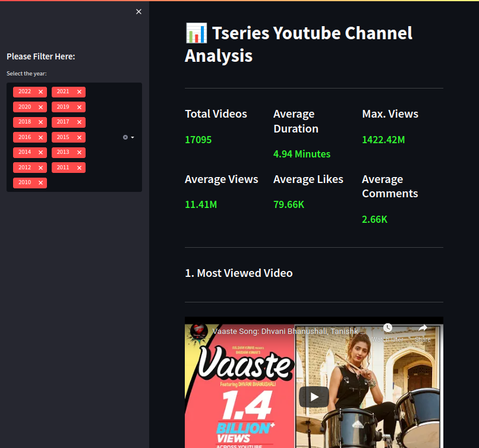

# Interactive T-series Youtube channel Analysis Dashboard Streamlitapp
T-Series channel on YouTube primarily shows music videos as well as film trailers. According to social blade its rank no.1 for Subscriber till 2022, Jul.

During this project I collected data from YouTube api and did some analysis. After that, I created an interactive web app dashboard using python. Streamlit and plotly. 

## Demo
[Interactive T-series Youtube channel Analysis Dashboard Streamlitapp](https://t-series-interactive-dashboard.herokuapp.com/)

## Screenshot


## Prerequisites
Install Python3 in your machine.


## Installation

  1. Open Command Line Interface
  2. Run the command ```git clone https://github.com/norochalise/T-series-channel-analysis-streamlitapp.git``` to clone the repository
  3. Run the command ```cd T-series-channel-analysis-streamlitapp``` to change directory
  4. For **Linux user** run command ``` python3 -m venv venv``` to create virtual environment. For **Window user** run ```python -m venv venv ```
  5. To Activate virtual environment for linux user run ```source venv/bin/activate ``` For window user run ``` .\venv\activate ```
  6. Run the command ```pip install -r requirements.txt``` to install all the dependencies

  7. Run the command ```streamlit run web_app.py```

  If there're any challenges while installing dependencies, run the command below to upgrade pip and try again. 

```python -m pip install --upgrade pip```

Some command can be different based on the OS so please  consider it.


## Data Collection and Data Analysis

To collect a tseries youtube channel dataset I used [youtube api](https://developers.google.com/youtube/v3). For data scraping from youtube api you can check inside of notebook folder. There is Tseries_Youtube_Channel_Analysis.ipynb. This is notebook for data collection and analysis. 

## Author
Noro Chalise
[ LinkedIn](https://www.linkedin.com/in/norochalise/)
&nbsp;
[ GitHub](https://github.com/norochalise)

## Reference

1. [Streamlit Cheetsheet](https://docs.streamlit.io/library/cheatsheet)

2. [Coding is Fun Youtube Channel](https://www.youtube.com/c/CodingIsFun)


3. [ Thu Vu data analytics Youtube Channel](https://www.youtube.com/c/Thuvu5)
